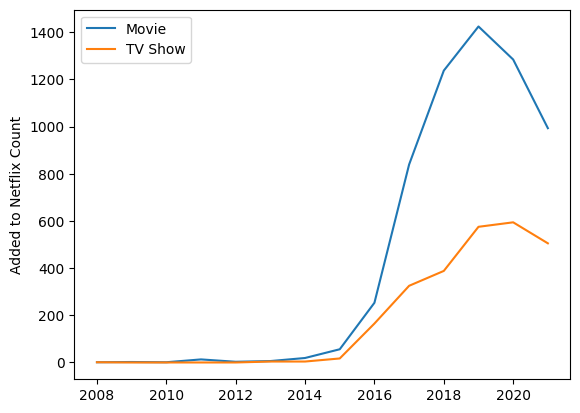
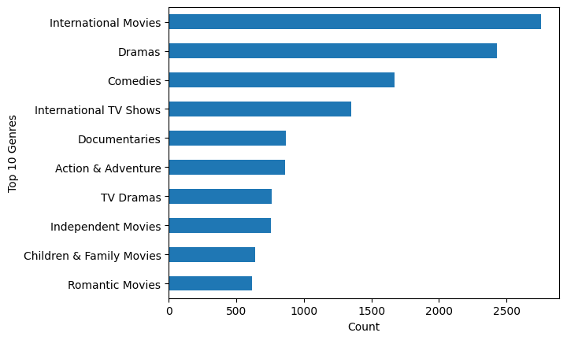
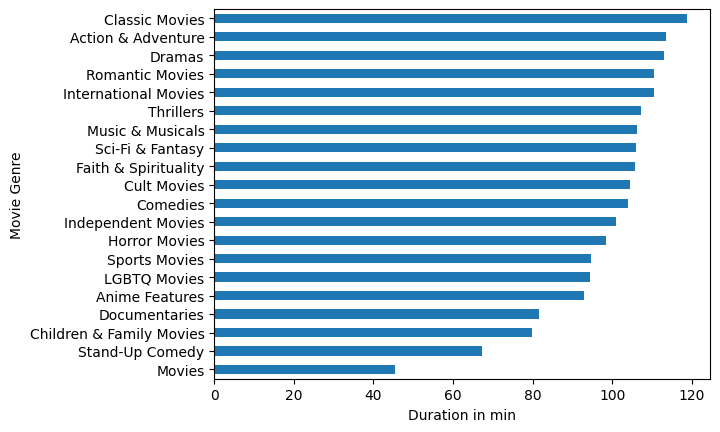
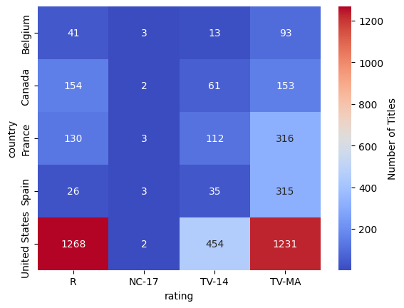
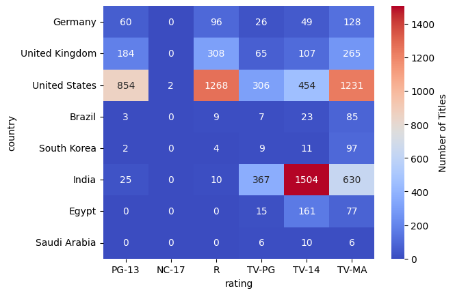
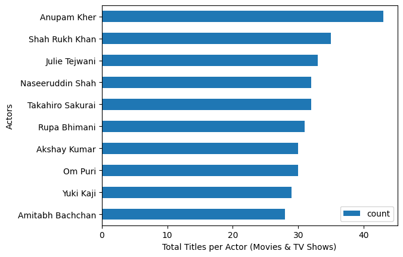

# Netflix Movie & Series Insights - Explorative Data Analysis

### 1. Introduction
Netflix is one of the largest streaming platforms, offering a diverse range of movies and TV shows. This project explores Netflix’s content library from *2008 to 2021* to uncover insights into trends, popular genres, and content distribution across different countries and time periods.

#### Objectives
This exploratory data analysis (EDA) aims to answer the following key questions:

- What is the total number of movies and TV shows available on Netflix for each year? 
- Which genres are the most popular on Netflix? 
- What is the average runtime of movies and TV shows by genre? 
- What countries have the most R rated movies / TV shows? 
- Who are the most frequent actors or directors on Netflix? 
- How have genre preferences changed over the years?
- What percentage of Netflix content is produced in the US vs. other countries? 

### 2. Dataset
- Dataset: Netflix Movies and TV Shows dataset
- Source: Kaggle Netflix Dataset

### 3. Key Insights & Findings
| Image 1 | Image 2 | Image 3 |
|---------|---------|---------|
|  |  |  |
|  |  |  |

### 4. Technologies Used
- Python (Pandas) for data processing
- Matplotlib & Seaborn for visualizations
- Jupyter Notebook for analysis

### 5. Next Steps & Improvements
- Perform sentiment analysis on movie descriptions.
- Compare Netflix’s catalog with competitors (e.g., Amazon Prime, Disney+).
- Predict genre trends using machine learning